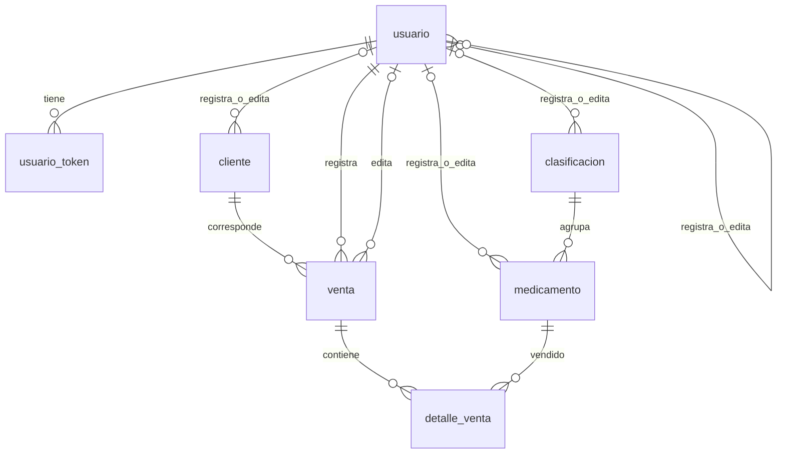

# Base MySQL de VitalCare: instalación y análisis del código

> Documento histórico de la versión MySQL. La aplicación actual usa PostgreSQL; consulta [la guía actual](postgresql/LEEME.md). Las comprobaciones y los defectos descritos debajo corresponden al código anterior a la migración. Para verificar la versión actual usa `postgresql/Verificar-Base.ps1`.

El esquema reconstruye las **siete tablas de negocio realmente utilizadas** por el proyecto y añade una tabla de auditoría, 24 triggers y dos vistas. Se validó en **MySQL 8.4.11** con **60 comprobaciones** que ejecutan los repositorios C# y el servicio de autenticación reales. El resultado completo está en [VALIDACION.txt](VALIDACION.txt).

La base permite satisfacer las consultas actuales de usuarios, bioquímicos, clientes, clasificaciones, medicamentos, ventas y tokens. Esto no corrige automáticamente los defectos de las páginas o servicios descritos más abajo. La prueba se hizo en un contenedor temporal: no se modificó la base remota ni la configuración activa del proyecto.

## Archivos y orden de ejecución

| Archivo | Función |
| --- | --- |
| [01_esquema_y_auditoria.sql](01_esquema_y_auditoria.sql) | Crea las tablas, relaciones, índices, restricciones, triggers y vistas. |
| [02_datos_iniciales.sql](02_datos_iniciales.sql) | Crea un administrador con bcrypt propio, siete clasificaciones y un consumidor final. |
| [03_roles_opcionales.sql](03_roles_opcionales.sql) | Define los permisos de aplicación y de consulta de auditoría. |
| [04_consultas_verificacion.sql](04_consultas_verificacion.sql) | Inspecciona estructura, historial, movimientos y diferencias entre cabecera y detalles. |
| [tools/Generar-HashAdmin.ps1](tools/Generar-HashAdmin.ps1) | Genera y verifica un bcrypt con la biblioteca que usa el proyecto. |
| [tools/Verificar-Base.ps1](tools/Verificar-Base.ps1) | Ejecuta las pruebas de integración en una instalación local de pruebas nueva. |
| [appsettings.Development.example.json](appsettings.Development.example.json) y [.env.example](.env.example) | Ejemplos de configuración sin credenciales reales. |

## Instalación

1. Usa **MySQL 8.4** y una base nueva/vacía llamada `farmacia`. Los scripts no son una migración de una base existente. No contienen `DROP TABLE`, `DROP DATABASE`, `TRUNCATE` ni desactivan las claves foráneas. El DDL no se revierte como una transacción de datos: detén la ejecución ante cualquier error y revisa los objetos que alcanzaron a crearse. No ejecutes el script repetidamente esperando que adapte columnas existentes.

2. Abre `01_esquema_y_auditoria.sql` en MySQL Workbench y ejecútalo completo con una cuenta autorizada para crear la base, tablas, índices, restricciones, vistas y triggers. Si el proveedor ya te asignó una base con otro nombre, cambia `CREATE DATABASE`/`USE` y los prefijos `farmacia.` de los demás scripts; el administrador del servicio puede tener que crear los triggers por sus políticas de privilegios/binlog. No elimines restricciones para sortear una incompatibilidad de versión.

3. Desde la raíz del proyecto, genera la contraseña del administrador:

   ```powershell
   powershell -NoProfile -ExecutionPolicy Bypass -File .\database\tools\Generar-HashAdmin.ps1
   ```

   La herramienta pide una contraseña sin mostrarla y entrega una sentencia `SET @admin_password_hash = '...';`. Usa entre 12 caracteres y 72 bytes UTF-8, sin espacios exteriores. `Bypass` se aplica solo a ese proceso, sin cambiar la política persistente de Windows. Se necesita el SDK .NET del proyecto; la herramienta usa el framework del SDK instalado y la biblioteca bcrypt compilada del proyecto.

4. En **la misma pestaña/conexión MySQL**, ejecuta la sentencia generada, opcionalmente cambia el nombre/email, y luego ejecuta todo `02_datos_iniciales.sql`:

   ```sql
   -- Primero pega aquí el SET @admin_password_hash generado por la herramienta.
   SET @admin_user_name = 'admin';
   SET @admin_email = 'admin@vitalcare.local';
   -- A continuación ejecuta 02_datos_iniciales.sql en esta misma conexión.
   ```

   El administrador queda activo, con rol exacto `Admin` y `must_change_password=0`, porque acabas de elegir su contraseña definitiva. Los nombres, CI y teléfono iniciales son marcadores administrativos de desarrollo. No se envía correo ni se insertan medicamentos o ventas ficticias. Si el usuario/email ya existe, el procedimiento falla sin reemplazar credenciales. La carga de datos sí es transaccional. Si un error deja creada la rutina `sp_instalar_datos_iniciales`, corrige las variables, ejecuta `CALL sp_instalar_datos_iniciales()` y elimina después esa rutina como indica el propio script.

5. Ejecuta `03_roles_opcionales.sql` como administrador. Completa sus sentencias comentadas `CREATE USER`, `GRANT` y `SET DEFAULT ROLE` para crear una cuenta de conexión propia. La identidad MySQL `farmacia_app` es distinta del usuario web `admin`; sus contraseñas también pueden ser diferentes. El host de la cuenta debe corresponder al origen real de la conexión. No asignes privilegios generales sobre `farmacia.*` a la aplicación, porque incluirían la tabla de auditoría.

6. Integra los valores del ejemplo JSON en `appsettings.Development.json` de la raíz. Conserva cualquier ajuste local que ya necesites. El nombre obligatorio es `ConnectionStrings:MySqlConnection`; especifica host, puerto, base, cuenta y contraseña reales. El ejemplo de `SslMode=Preferred` es para localhost; para un servidor remoto configura TLS y verificación de certificado según ese servidor.

7. Crea o completa `.env` en la raíz usando el ejemplo. Para generar la clave JWT desde Windows PowerShell:

   ```powershell
   $jwtBytes = New-Object byte[] 48
   $jwtGenerator = [System.Security.Cryptography.RandomNumberGenerator]::Create()
   $jwtGenerator.GetBytes($jwtBytes)
   $jwtGenerator.Dispose()
   [Convert]::ToBase64String($jwtBytes)
   ```

   Copia el resultado a `JWT_KEY` y conserva `JWT_ISSUER` y `JWT_AUDIENCE` del ejemplo para desarrollo local. No dejes el marcador `REEMPLAZAR`. El primer arranque realizado en esta conversación usó una clave temporal en el proceso; eso no creó un `.env` persistente.

8. Ejecuta desde la raíz y entra con `admin` y la contraseña que elegiste:

   ```powershell
   dotnet run --launch-profile http
   ```

   URL: `http://localhost:5081/Auth/Login`. Si el proceso anterior aún ocupa el puerto 5081, detenlo antes de iniciar el nuevo. Reinicia la aplicación después de cambiar la cadena: el singleton conserva el valor cargado inicialmente. Ejecuta `04_consultas_verificacion.sql` para revisar la instalación.

El SMTP del ejemplo necesita tus datos reales para registrar usuarios mediante las pantallas que envían activación. El administrador inicial permite acceder sin depender de ese envío. Crear tablas no instala ni inicia el servidor MySQL; el servicio debe estar disponible en el host/puerto configurado.

## Reconstrucción del modelo y decisiones de compatibilidad

Se inspeccionaron los siete modelos de persistencia, seis repositorios activos, sus consultas parametrizadas, servicios, validadores, formularios Razor, configuración de conexión y autenticación. El repositorio `VentaRepository` cubre dos tablas. No se encontró un esquema SQL previo que se pudiera recuperar: los tipos y límites no demostrados por el código son decisiones explícitas de este esquema, no una copia de la base remota.

| Tabla | Clave | Contrato con el código y decisión |
| --- | --- | --- |
| `usuario` | `id INT AUTO_INCREMENT` | Campos personales, `user_name`, `password_hash`, `role`, `activo`, `must_change_password`, fechas e `id_usuario`. Email y usuario únicos globalmente, incluso al desactivar la cuenta. CI se indexa sin hacerlo único: el servicio actual no impone esa regla. |
| `usuario_token` | `id INT AUTO_INCREMENT` | Conserva el nombre `usuario_idUsuario`. Hash SHA-256 hexadecimal de 64 caracteres; no es el JWT ni un bcrypt. Fechas UTC, flags y fechas de consumo/revocación. |
| `clasificacion` | `id INT AUTO_INCREMENT` | Nombre y origen de 45 caracteres y descripción de 100 según validador. Nombre único solo entre filas activas. |
| `cliente` | `id INT AUTO_INCREMENT` | NIT de texto, razón social de 45 y correo nullable de 45. NIT único solo entre activos, excluyendo `CF`, que el servicio permite repetir. |
| `medicamento` | `id INT AUTO_INCREMENT` | Nombre, presentación, concentración, clasificación, precio, stock, estado, fechas y editor. Precio decimal positivo de hasta 1000 según validador; stock entero no negativo. |
| `venta` | `id INT AUTO_INCREMENT` | Nombres exactos `Cliente_idCliente`, `usuario_idUsuario` e `Id_usuario_editor`. Guarda también `nit` y `razon_social` como copias históricas, no solo la FK al cliente. |
| `detalle_venta` | `(id_venta, id_medicamento)` | Una línea por medicamento en cada venta, cantidad positiva y precio unitario histórico. El modelo C# no requiere un `id` adicional ni una columna `subtotal`. |
| `auditoria` | `id BIGINT UNSIGNED AUTO_INCREMENT` | Historial de cambios con clave JSON, valores anteriores/nuevos, fecha UTC, conexión, actor explícito y correlación opcional. |

La pantalla de **bioquímicos está activa** y usa `IUsuarioService`, filtrando `role='Bioquimico'`: [Bioquimico.cshtml.cs](../Pages/Bioquimico/Bioquimico.cshtml.cs). El viejo `BioquimicoRepository` está comentado. Por eso no se crea una tabla `bioquimico` separada. Tampoco hacen falta tablas de sesión, SMTP, roles o estadísticas para satisfacer el código actual: la sesión está en memoria, SMTP en configuración, roles en `usuario` y estadísticas mediante consultas.



Las relaciones físicas no obligan a que una venta tenga detalles: esa regla involucra varias tablas y se valida en el flujo transaccional. `vw_ventas_descuadradas` detecta ventas vacías o diferencias entre total y detalles después de confirmar la operación.

Los identificadores usan `INT` con signo para corresponder a `GetInt32`/`int` en C#. Se usa `TINYINT` con signo para corresponder a `GetSByte`. Los importes usan `DECIMAL`, con dos decimales, y el total tiene mayor capacidad que el precio unitario. Las fechas que omiten los INSERT tienen valor por defecto; las últimas actualizaciones se completan automáticamente, incluso cuando una venta modifica solo el stock.

No se impuso un máximo de 100000 al saldo de stock: el validador limita la cantidad de una entrada y ciertos formularios, pero entradas acumuladas y devoluciones pueden superar ese saldo. Sí se impide cualquier saldo negativo. Presentación/concentración tienen un límite elegido de 100 caracteres; el backend no define un máximo explícito para ambos. Debe alinearse la validación de formularios si se necesita otro límite.

Las claves únicas condicionales usan columnas generadas que devuelven `NULL` en filas excluidas. Esto permite recrear una clasificación eliminada lógicamente y registrar otra fila con el NIT de un cliente inactivo. `CF` queda excluido para respetar el servicio. MySQL permite múltiples `NULL` en un índice único. [Documentación de índices MySQL](https://dev.mysql.com/doc/refman/8.4/en/create-index.html).

Las claves foráneas usan `RESTRICT`: una baja lógica conserva todas las referencias. El código elimina físicamente detalles al editar una venta y tokens obsoletos; esos DELETE quedan auditados. No se agregaron cascadas, porque las acciones en cascada de las claves foráneas no activan triggers en MySQL. [Documentación de CREATE TRIGGER](https://dev.mysql.com/doc/refman/8.4/en/create-trigger.html).

Los índices priorizan FK, filtros por estado, orden por nombre/fecha, login y limpieza de tokens. Las búsquedas actuales usan `LIKE '%texto%'`; un índice B-tree no elimina por sí solo el recorrido asociado a esos patrones. `ORDER BY RAND()` para destacados también puede ser costoso al crecer el catálogo. No se añadieron índices a cada campo sin una consulta que los justifique.

## Qué registra la auditoría

Cada tabla de negocio tiene triggers `AFTER INSERT`, `AFTER UPDATE` y `AFTER DELETE`: **21 triggers de registro**. Se añaden dos que rechazan cambios/eliminaciones del historial y uno que normaliza las transiciones de uso/revocación de tokens a UTC: **24 en total**.

Los eventos distinguen `INSERT`, `UPDATE`, `DELETE`, `BAJA_LOGICA` y `REACTIVACION`. Las bajas detectan `estado` o `activo`, según la tabla. Los cambios repetidos sin diferencia también producen evento UPDATE: se registra la ejecución sobre la fila, sin prometer que todos sus valores variaron. La identidad compuesta del detalle se conserva en JSON.

El historial incluye copias de los campos de negocio, pero excluye `password_hash` y `token_hash`. Un cambio de esas credenciales activa `credencial_modificada=1`, sin conservar su contenido. Sí contiene datos personales como CI, correo y NIT; la cuenta web no recibe permiso para leer el historial. No se duplica una FK desde auditoría hacia las filas originales o el actor, para preservar su historia si dejan de existir.

Todos los registros de auditoría usan InnoDB y participan en la transacción de negocio. Si una venta falla después de insertar su cabecera, detalle o descontar stock, el rollback elimina también los eventos no confirmados. Por tanto esta auditoría describe **cambios confirmados**, no intentos fallidos, SELECT, accesos HTTP, DDL ni intentos de login rechazados. Capturar esos otros eventos necesita instrumentación de aplicación o del servidor. [Comportamiento transaccional de triggers](https://dev.mysql.com/doc/refman/8.4/en/trigger-syntax.html).

Los triggers no vuelven a calcular el total ni modifican stock. `VentaRepository` ya realiza esas escrituras dentro de transacciones; duplicarlas en SQL produciría dobles descuentos o devoluciones. `vw_auditoria_stock` muestra el saldo inicial insertado y las diferencias de las actualizaciones, con signo. No clasifica automáticamente su causa como venta, compra o devolución: sin un contexto de operación, el código actual no permite determinarla siempre. Un DELETE físico del medicamento se ve en el historial general, no como un movimiento adicional de esa vista.

El ID de auditoría ordena su asignación, no garantiza orden de COMMIT entre transacciones concurrentes; puede tener huecos tras un rollback. `CONNECTION_ID()` identifica una conexión reutilizable, no una operación de negocio. Para correlacionar operaciones se utiliza `solicitud_id` cuando el backend la envía.

## Atribución del usuario: límite actual y conexión necesaria

MySQL conoce la cuenta técnica que abre la conexión, pero no la sesión ASP.NET. `USER()` registra esa identidad SQL. No se usa `CURRENT_USER()` para identificar al operador, porque dentro del trigger devuelve la cuenta de su definidor. [Identidad y privilegios de triggers](https://dev.mysql.com/doc/refman/8.4/en/create-trigger.html).

Las columnas existentes `id_usuario` no resuelven completamente la atribución: suelen contener el último editor; las ventas descuentan stock sin actualizarlas; el dueño de un token tampoco tiene por qué ser quien lo revoca. Los triggers preservan esos campos en las copias JSON, pero no los presentan como prueba de quién ejecutó la operación actual. Cuando no existe contexto, guardan `usuario_app_id=NULL` y `origen_actor='SIN_CONTEXTO'`.

Para atribuir todos los cambios a un usuario web, hay que integrar esto en **cada conexión de escritura** del backend, antes de ejecutar las consultas:

```sql
SET @audit_usuario_id = 17; -- ID obtenido de la identidad autenticada en el servidor.
SET @audit_solicitud_id = 'identificador-de-la-operacion';
SET @audit_motivo = 'Registro de venta';
-- BEGIN / escrituras / COMMIT o ROLLBACK en esta misma conexion.
SET @audit_usuario_id = NULL, @audit_solicitud_id = NULL, @audit_motivo = NULL;
```

En C# deben usarse parámetros para los valores, `Allow User Variables=True` y una limpieza en `finally`, incluyendo las rutas de error, antes de devolver la conexión al pool. La configuración de ejemplo activa además `Connection Reset=True`. Configurarlo en una conexión auxiliar o solo en un middleware HTTP no alcanza: los repositorios actuales abren conexiones por su cuenta. Conviene introducir una fábrica de conexiones común que reciba el contexto autenticado y la correlación; en operaciones sin usuario autenticado debe enviar NULL.

El SQL funciona con el backend actual, pero esa integración C# **no se incluyó en este pedido de scripts**. Las variables son contexto declarado por la aplicación, no una identidad criptográficamente verificada por MySQL: quien posea credenciales SQL también podría declararlas. No se debe aceptar el actor directamente de un formulario ni prometer trazabilidad inviolable.

Los triggers que bloquean UPDATE/DELETE y los roles reducen modificaciones accidentales del historial. Un administrador MySQL con DDL puede quitar triggers o truncar tablas; esa garantía requiere separación de privilegios, copias externas y controles operativos. No existe aquí una cadena criptográfica ni almacenamiento externo inmutable. El historial no se purga automáticamente y necesita una política de archivo acorde al uso real.

## Hallazgos del código que el esquema no corrige

| Prioridad | Evidencia | Impacto y trabajo pendiente |
| --- | --- | --- |
| Bloqueo de arranque | `Program.cs:154` exige tres variables JWT; `ConexionStringSingleton.cs:32` lee JSON. | La base por sí sola no permite arrancar sin JWT ni conecta automáticamente al MySQL local. El singleton no agrega variables de entorno a su configuración de conexión y lee Development incluso fuera de Development. |
| Bloqueo de conexión observado | El arranque previo produjo `Reading from the stream has failed` / `EndOfStreamException` contra el destino remoto configurado. | Ese error no demuestra que falten tablas: ocurre al abrir la conexión. Primero deben funcionar servidor, puerto, credenciales y TLS; recién entonces aplica el esquema. |
| Alta: edición de ventas | `Pages/Venta/VentaUpdate.cshtml.cs:73`. | `OnPostActualizarVenta()` solo redirige con un mensaje de éxito; no llama al facade. Crear tablas no hace que esa pantalla guarde. El repositorio sí fue probado directamente. |
| Alta: edición de usuarios | `Pages/Usuario/UsuarioEdit.cshtml.cs:28` y `Domain/Validators/UsuarioValidacion.cs:56`. | La pantalla carga email/rol, omite datos personales y envía nombres nulos; el validador exige nombres, apellido, CI y teléfono. Se necesita un DTO/validador de edición parcial o cargar y enviar los campos requeridos. |
| Alta: atribución completa | `VentaRepository.cs:285`, `:410`, `:536`; `UsuarioRepository.CambiarPassword`. | Algunas escrituras no comunican el actor actual. Integrar contexto en la misma conexión y limpiar el pool como se explicó. |
| Alta: edición concurrente de una venta | `VentaRepository.cs:471` y lecturas iniciales de edición/anulación. | No se bloquea la cabecera con `SELECT ... FOR UPDATE` al iniciar todos los flujos. Dos editores pueden trabajar sobre detalles anteriores y restituir stock basándose en un estado desactualizado. La anulación secuencial y el descuento condicionado fueron probados; eso no prueba ausencia de carreras. Unificar bloqueo de cabecera, orden de bloqueos y tratamiento de deadlocks. |
| Alta: validación del stock al editar | `Application/Services/VentaService.cs:152`. | Se compara la nueva cantidad con el stock disponible antes de devolver las unidades de la venta anterior. Puede rechazar mantener una venta que agotó existencias. Además usa el precio actual del catálogo al reconstruirla (`:156`), lo que puede alterar el importe histórico. Definir y aplicar la regla de edición antes de habilitar la pantalla. |
| Media: registro y SMTP | `UsuarioService.cs:62` y `:64`. | La cuenta y token se insertan antes de enviar correo; si SMTP falla, el servicio informa error aunque la cuenta ya exista. El enlace de activación está fijado a localhost:5081. Configurar SMTP/base URL y un mecanismo de reenvío o bandeja de salida transaccional. |
| Media: activación de cuenta | `UsuarioService.cs:180` y `:184`. | Cambiar contraseña y marcar el token usado son operaciones en conexiones distintas. La activación no es atómica ante concurrencia/fallos. Se necesita consumo condicionado y actualización de contraseña en una misma transacción. |
| Media: autenticación | `AuthService.cs:54` y `Pages/Auth/Login.cshtml.cs:50`. | El resultado devuelto por la generación del token se ignora antes de devolver éxito. `MustChangePassword` se guarda en sesión, pero no se encontró una restricción general que fuerce ese cambio. Los tokens de login persistidos no son el JWT emitido; revocar esas filas no implica por sí solo revocar el JWT. |
| Media: fechas de tokens | `TokenRepository.cs:93`, `:106`, `:125`. | Crea/interpreta fechas en UTC, pero usa NOW() para uso, revocación y limpieza. El trigger incluido normaliza las dos transiciones; la limpieza debe usar `UTC_TIMESTAMP()` o ejecutarse en conexiones UTC. El esquema no cambia globalmente el huso del servidor. |
| Media: estados relacionados | Consultas de medicamentos y clasificaciones. | Las FK garantizan existencia, no estado activo. Las bajas de clasificación se controlan en servicio; una carrera o SQL directo puede dejar un medicamento activo relacionado con una clasificación inactiva. La consulta de verificación lo identifica. |
| Media: totales y límites | `VentaValidacion` y `VentaRepository`. | Una restricción CHECK no puede validar la suma de filas de otra tabla. Los totales los calcula C#; la vista detecta discrepancias. El esquema no reproduce todas las expresiones regulares de los formularios; mantiene las restricciones estructurales principales. |
| Baja: estadísticas | `Count()` de cliente, medicamento, usuario y venta. | Algunos contadores incluyen registros inactivos/anulados mientras sus listados los excluyen. Debe definirse si el dashboard quiere totales históricos o activos. |

Las restricciones CHECK se usan para valores de la propia fila; no permiten subconsultas que validen sumas entre tablas. [Restricciones CHECK de MySQL](https://dev.mysql.com/doc/refman/8.4/en/create-table-check-constraints.html).

El objetivo del script es reconstruir el contrato de persistencia y registrar cambios. No agrega lotes, vencimientos, proveedores, compras, recetas ni un sistema fiscal de facturación: no existen esos contratos en los repositorios revisados. El comprobante PDF se genera en C# y no requiere otra tabla, aunque no se validó visualmente en estas pruebas.

## Validación reproducible y alcance de la evidencia

Se aplicó `01` en MySQL 8.4.11 dentro de un contenedor nuevo, con tablas sensibles a mayúsculas/minúsculas de Linux. El nombre de las tablas en SQL es minúsculo, como en los repositorios activos. Después se ejecutó `02` con un bcrypt aleatorio, y finalmente `03` y las pruebas de permisos.

Las 60 comprobaciones cubren instalación, lecturas y filtros, login real, unicidad activa y excepción CF, FK, stock negativo, venta/edición/anulación desde repositorio, rollback tras escrituras parciales, conservación del NIT histórico, token usado/revocado/obsoleto, credenciales omitidas del historial, actor explícito/ausente, vista de stock, conciliación y permisos de la cuenta de aplicación.

El verificador rechaza destinos no locales y bases que ya tengan usuarios o auditoría; **inserta y modifica datos de prueba**, por lo que debe ejecutarse en una instancia desechable con `01` aplicado y sin ejecutar `02` antes. Usa el esquema fijo `farmacia`, una cuenta administradora de pruebas y lee la conexión de `VITALCARE_TEST_CONNECTION`. No imprime esa conexión. Para reproducir:

```powershell
# Define VITALCARE_TEST_CONNECTION en esta sesion con la conexion a tu MySQL de pruebas.
powershell -NoProfile -ExecutionPolicy Bypass -File .\database\tools\Verificar-Base.ps1
```

La herramienta genera su proyecto temporal y configuración bajo `obj/DatabaseVerification`, excluido de Git. Su código fuente revisable es [Verificacion.cs.txt](tools/Verificacion.cs.txt); la extensión evita incluirlo en la compilación web. Se comprobó también de forma interactiva la generación de bcrypt del administrador.

No se ejecutaron pruebas concurrentes de carga, migraciones sobre datos existentes, envío real de correo, recorrido completo de todas las páginas ni pruebas visuales del PDF. Las 60 comprobaciones no deben interpretarse como que esas áreas están corregidas. Los fallos del backend señalados proceden de la inspección del código; los resultados de base y repositorios proceden de ejecución real.
